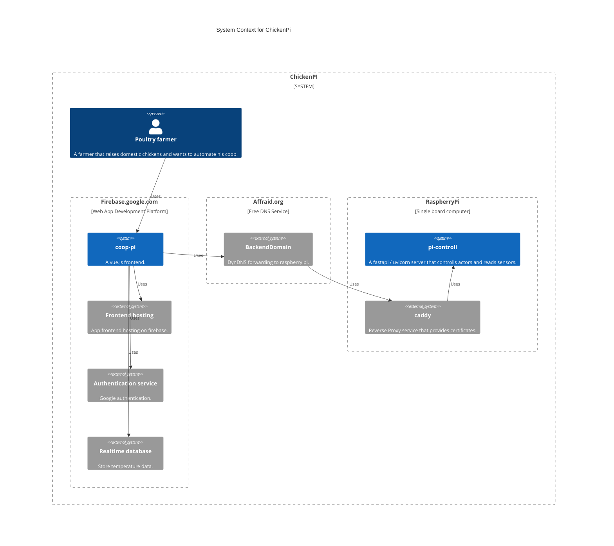
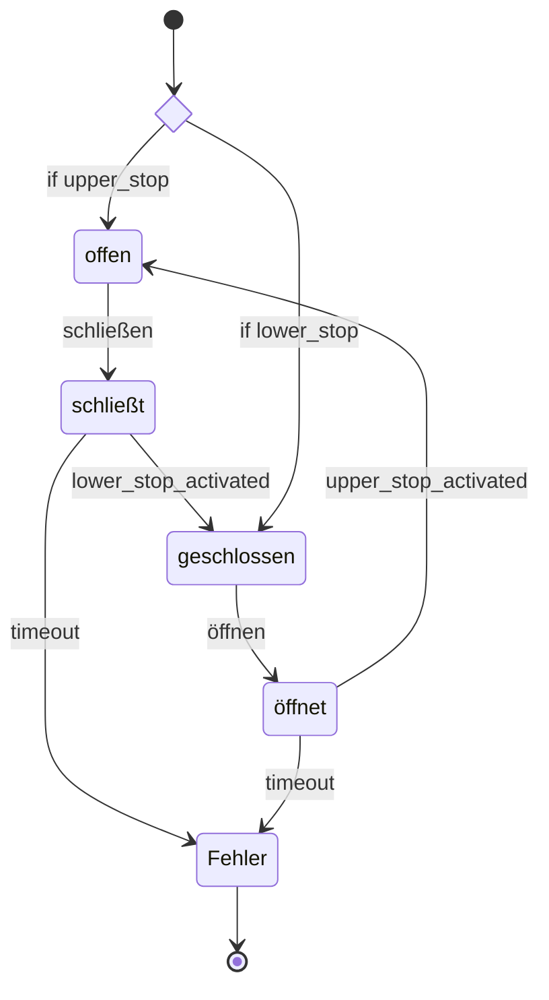

# pi-controll

```mermaid
C4Context
    title System Context for ChickenPi
    System_Boundary(b0, "ChickenPI") {
        Person(customerA, "Poultry farmer", "A farmer that raises domestic chickens and wants to automate his coop.")

        Boundary(b4, "Firebase.google.com", "Web App Development Platform") {
            System(SystemE, "coop-pi", "A vue.js frontend.")
            System_Ext(SystemD, "Frontend hosting", "App frontend hosting on firebase.")
            System_Ext(SystemF, "Authentication service", "Google authentication.")
            System_Ext(SystemG, "Realtime database", "Store temperature data.")
            
        }
        Boundary(b3, "Affraid.org", "Free DNS Service") {
                    System_Ext(SystemC, "BackendDomain", "DynDNS forwarding to raspberry pi.")
                }

        Boundary(b2, "RaspberryPi", "Single board computer") {
            System(SystemA, "pi-controll", "A fastapi / uvicorn server that controlls actors and reads sensors.")
            System_Ext(SystemB, "caddy", "Reverse Proxy service that provides certificates.")

        }
    
        Rel(customerA, SystemE, "Uses")
        Rel(SystemE, SystemC, "Uses")
        Rel(SystemE, SystemF, "Uses")
        Rel(SystemE, SystemD, "Uses")
        Rel(SystemE, SystemG, "Uses")
        Rel(SystemC, SystemB, "Uses")
        Rel(SystemB, SystemA, "Uses")
    }
    UpdateLayoutConfig($c4ShapeInRow="1", $c4BoundaryInRow="3")
```

## State transitions of the coop door

```mermaid
stateDiagram-v2
    state if_state <<choice>>
    [*] --> if_state
    if_state --> offen: if upper_stop 
    offen --> schließt : schließen
    schließt --> Fehler : timeout    
    schließt --> geschlossen : lower_stop_activated 
    if_state --> geschlossen : if lower_stop
    geschlossen --> öffnet : öffnen
    öffnet --> Fehler : timeout
    öffnet --> offen : upper_stop_activated
    Fehler --> [*]
```

